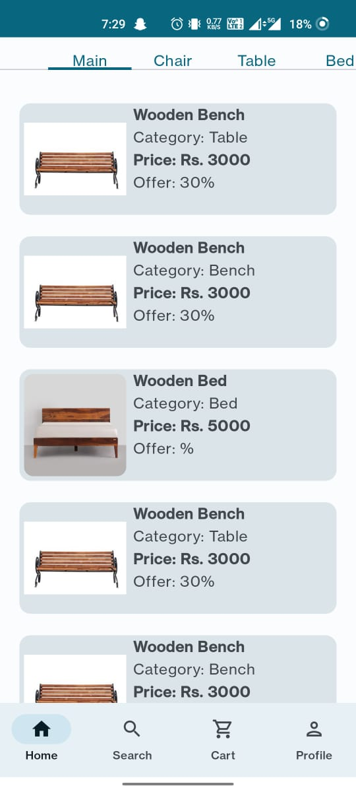
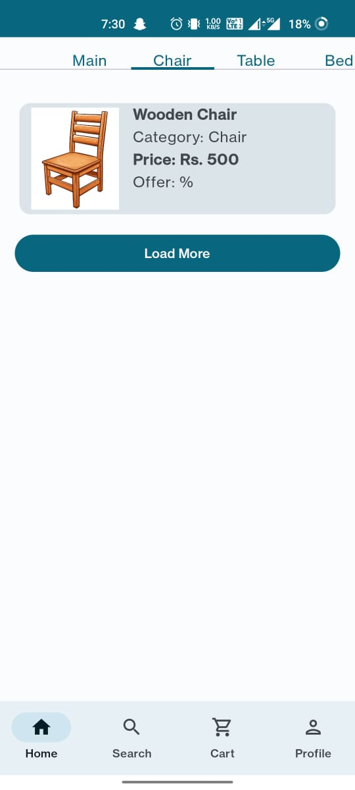
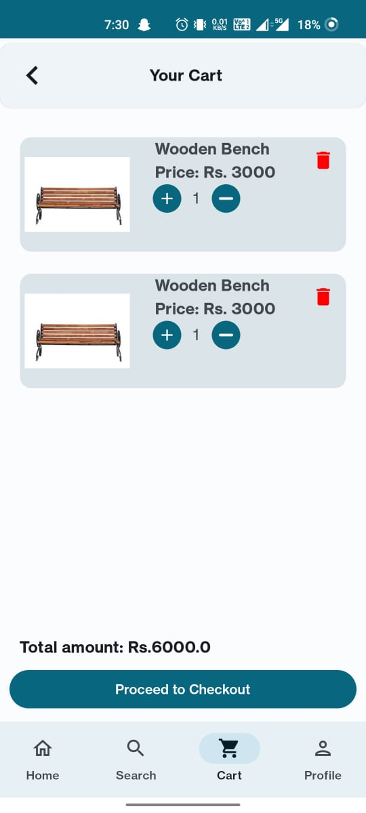
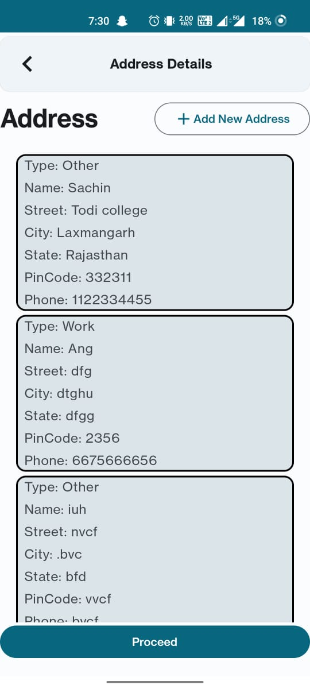
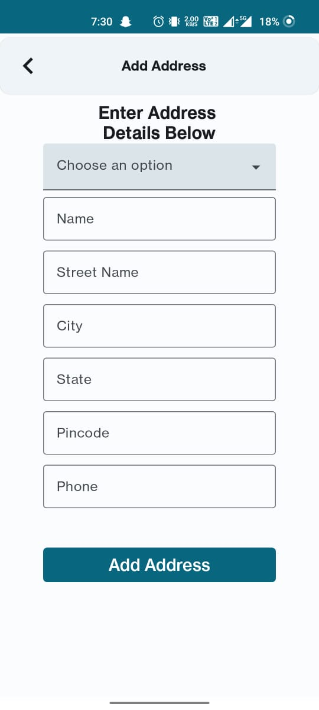
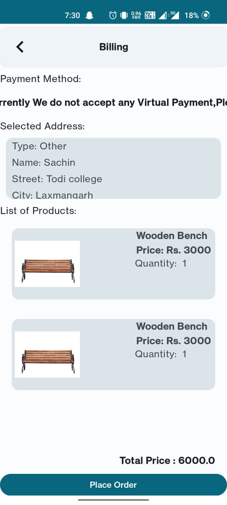
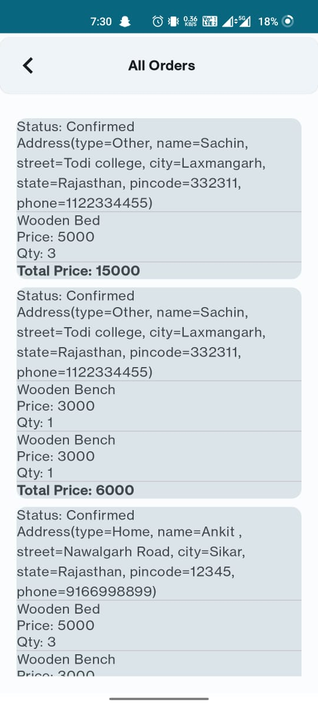

<!DOCTYPE html>
<html lang="en">
<head>
  <meta charset="UTF-8">
  <meta name="viewport" content="width=device-width, initial-scale=1.0">
  Image Gallery
</head>
<body>

<table>
  <tr>
    <td>Image 1</td>
    <td>Image 2</td>
    <td>Image 3</td>
  </tr>
  <tr>
    <td valign="top"></td>
    <td valign="top"></td>
    <td valign="top"></td>
  </tr>
  <tr>
    <td>Image 4</td>
    <td>Image 5</td>
    <td>Image 6</td>
  </tr>
  <tr>
    <td valign="top"></td>
    <td valign="top"></td>
    <td valign="top"></td>
  </tr>
  <tr>
    <td>Image 7</td>
    <td>Image 8</td>
    <td>Image 9</td>
  </tr>
  <tr>
    <td valign="top"></td>
    <td valign="top"></td>
    <td valign="top"></td>
  </tr>
  <tr>
    <td>Image 10</td>
    <td>Image 11</td>
    <td>Image 12</td>
  </tr>
  <tr>
    <td valign="top"></td>
    <td valign="top"></td>
    <td valign="top"></td>
  </tr>
  <tr>
    <td>Image 13</td>
    <td>Image 14</td>
    <td></td>
  </tr>
  <tr>
    <td valign="top"></td>
    <td valign="top"></td>
    <td></td>
  </tr>
</table>

</body>
</html>
